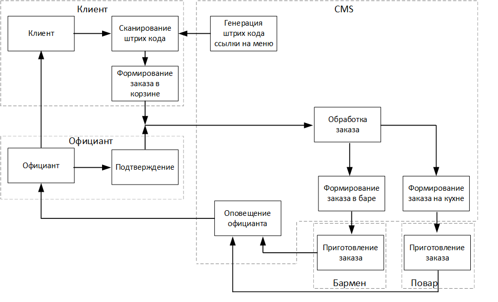

# Delicious Coffee

 Delicious Coffee - это CRM система для автоматизации предприятия общепита среднего размера.
 
 ## Основные задачи
 1. Предоставление меню в реальном времени (с учётом отсутствия позиций в данный момент).
 2. Формирование заказа онлайн для каждого стола в зале.
 3. Подтверждение заказа официантом.
 4. Предоставление рекомендаций посетителям.
 5. Формирование счёта на стол или каждого гостя в отдельности.
 6. Фиксация времени на приготовление блюд.

### Схема обработки заказа

    

